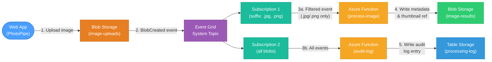

# Lab 4: PhotoPipe — Event-Driven Image Processing with Event Grid & Functions

## CST8917 — Serverless Applications | Winter 2026

**St: Olga Durham** \
**St#: 040687883**

---

## Deliverables

Submit a **GitHub repository URL** containing:

| Item / Link                     | Description                                                   |
| ------------------------------- | ------------------------------------------------------------- |
| [function_app.py]()             | The Azure Functions code (provided — should be in your repo)  |
| [requirements.txt]()            | Python dependencies                                           |
| [test-function.http]()          | REST Client test requests                                     |
| [client.html]()                 | PhotoPipe web app                                             |
| [local.settings.example.json]() | Settings template with placeholder values (NOT the real keys) |
| [README.md](./README.md)        | Brief setup instructions for your project                     |
| **[Demo Video Link]()**         | YouTube link (in your README or submitted separately)         |

> **Security Reminder:** Do NOT commit `local.settings.json`, SAS tokens, or storage account keys. Create a `local.settings.example.json` with placeholder values.

### Demo Video Requirements

Record a demonstration (maximum 5 minutes) showing:

| #   | What to Show                                                                                                             |
| --- | ------------------------------------------------------------------------------------------------------------------------ |
| 1   | Storage account in Azure Portal: both blob containers and the CORS configuration                                         |
| 2   | Event Grid system topic with both subscriptions — show the filters on subscription 1                                     |
| 3   | Upload a `.jpg` image through PhotoPipe and show the **processing result** appear                                        |
| 4   | Upload a `.png` image and show the result                                                                                |
| 5   | Upload a **non-image file** (e.g., `.txt`) and show that only the **audit log** receives an entry (no processing result) |
| 6   | Show the **Audit Log** tab with entries for all three uploads                                                            |
| 7   | Show Event Grid **Metrics** in the portal — published events, matched events, and delivery succeeded                     |
| 8   | Show the `image-results` container in the portal with the metadata JSON files                                            |

| Requirement  | Details                    |
| ------------ | -------------------------- |
| **Duration** | Maximum 5 minutes          |
| **Audio**    | Not required               |
| **Platform** | YouTube (unlisted is fine) |

### Submission Format

Submit only your **GitHub repository URL** to Brightspace.

---

## Overview

In this lab you will build **PhotoPipe**, an event-driven image processing pipeline that uses **Azure Event Grid** and **Azure Functions** to automatically process images when they are uploaded to Azure Blob Storage.

A user uploads an image through a web application. The upload triggers an **Event Grid** `BlobCreated` event, which routes to an Azure Function that generates metadata (dimensions, file size, dominant color analysis) and a thumbnail reference, then stores the results in a separate container. A second Event Grid subscription notifies another function that logs all processing activity to **Table Storage** for an audit trail.

**What You'll Build:**

- A **web application** (provided) for uploading images and viewing processing results
- An **Azure Function** (provided) that analyzes uploaded images and generates metadata
- An **Azure Function** (provided) that logs processing events to Table Storage for auditing
- **Event Grid system topic** and subscriptions that react to Blob Storage events
- **Blob Storage** containers for uploads, processed results, and thumbnails
- **Table Storage** for the audit log

---

## Architecture



### How It Works

1. A user uploads an image through the **PhotoPipe web app**, which stores it directly in **Azure Blob Storage** (`image-uploads` container)
2. Blob Storage emits a **`Microsoft.Storage.BlobCreated`** event via the **Event Grid system topic**
3. **Subscription 1** has a **subject suffix filter** (`.jpg` and `.png`) and routes matching events to the `process-image` function
4. **Subscription 2** routes **all** blob-created events to the `audit-log` function for logging
5. The `process-image` function reads the blob, extracts metadata (size, content type, upload timestamp), generates a simulated thumbnail reference, and writes a JSON result to the `image-results` container
6. The `audit-log` function writes an entry to **Table Storage** recording the event type, blob URL, timestamp, and processing status

### Services Used

| Service                              | Role                                                          |
| ------------------------------------ | ------------------------------------------------------------- |
| **Blob Storage** (`image-uploads`)   | Receives uploaded images from the web client                  |
| **Blob Storage** (`image-results`)   | Stores processing metadata and thumbnail references           |
| **Event Grid System Topic**          | Captures `BlobCreated` events from the storage account        |
| **Event Grid Subscription 1**        | Filters for `.jpg`/`.png` files and triggers image processing |
| **Event Grid Subscription 2**        | Captures all blob events for audit logging                    |
| **Azure Function** (`process-image`) | Analyzes images and writes metadata to results container      |
| **Azure Function** (`audit-log`)     | Logs all upload events to Table Storage                       |
| **Table Storage** (`processinglog`)  | Stores the audit trail of all processed events                |
| **Web Client** (`client.html`)       | PhotoPipe web app for uploading images and viewing results    |

---

## Part 1: Create the Storage Account

### Step 1.1: Create a Resource Group

If you don't already have a resource group for this course, create one:

1. Open the [Azure Portal](https://portal.azure.com)
2. Search for **Resource groups** in the top search bar
3. Click **+ Create**
4. Configure:

| Field              | Value                                       |
| ------------------ | ------------------------------------------- |
| **Subscription**   | Your Azure subscription                     |
| **Resource group** | `rg-serverless-lab4`                        |
| **Region**         | `Canada Central` (or your preferred region) |

5. Click **Review + create** -> **Create**

### Step 1.2: Create a Storage Account

1. In the Azure Portal, search for **Storage accounts**
2. Click **+ Create**
3. Configure:

| Field                    | Value                                              |
| ------------------------ | -------------------------------------------------- |
| **Subscription**         | Your Azure subscription                            |
| **Resource group**       | `rg-serverless-lab4`                               |
| **Storage account name** | A globally unique name (e.g., `yournamephotopipe`) |
| **Region**               | Same as your resource group                        |
| **Performance**          | Standard                                           |
| **Redundancy**           | LRS (Locally-redundant storage)                    |

4. Click **Review + create** -> **Create**
5. Wait for deployment, then click **Go to resource**

### Step 1.3: Enable Blob Anonymous Access (Account Level)

By default, Azure storage accounts have **Allow Blob anonymous access** set to **Disabled**. You must enable this at the account level before you can set public access on individual containers.

1. In your storage account, click **Configuration** in the left menu under **Settings**
2. Find **Allow Blob anonymous access** and set it to **Enabled**
3. Click **Save** at the top of the page

> **Why is this needed?** The web client displays image previews by loading them directly from Blob Storage via their public URL. Without anonymous read access, the browser cannot fetch the images. In production, you would use SAS tokens or a CDN with authentication instead.

### Step 1.4: Create Blob Containers

1. In your storage account, click **Containers** in the left menu under **Data storage**
2. Create two containers:

| Container Name  | Public Access Level                         |
| --------------- | ------------------------------------------- |
| `image-uploads` | Blob (anonymous read access for blobs only) |
| `image-results` | Private (no anonymous access)               |

> **Note:** The **Blob** access level allows anonymous read access to individual blobs but not container listing. This lets the web client display image previews. The `image-results` container stays private since only the Azure Function reads from it.

### Step 1.5: Enable Table Storage

Table Storage is automatically available in your storage account. No separate creation is needed — the Azure Function will create the `processinglog` table automatically when it writes the first entry.

### Step 1.6: Configure CORS for the Storage Account

The web client needs to upload blobs directly from the browser. Configure CORS to allow this:

1. In your storage account, click **Resource sharing (CORS)** in the left menu under **Settings**
2. Under the **Blob service** tab, add a rule:

| Field               | Value                     |
| ------------------- | ------------------------- |
| **Allowed origins** | `*`                       |
| **Allowed methods** | `GET, PUT, OPTIONS, HEAD` |
| **Allowed headers** | `*`                       |
| **Exposed headers** | `*`                       |
| **Max age**         | `3600`                    |

3. Click **Save**

> **Security Note:** In production, you would restrict `Allowed origins` to your application's domain. The wildcard is for lab convenience only.

### Step 1.7: Copy Storage Account Credentials

1. In your storage account, click **Access keys** in the left menu under **Security + networking**
2. Copy the following values — save them for later steps:
   - **Storage account name**
   - **Key** (Key1)
   - **Connection string** (Key1)

---

## Part 2: Create and Deploy the Azure Functions

The Function App contains two functions: one that processes images and generates metadata, and one that logs events for auditing.

### Step 2.1: Create a New Functions Project

1. Press `F1` -> **Azure Functions: Create New Project...**
2. Choose a new empty folder (e.g., `PhotoPipeFunctionApp`)

| Prompt                          | Your Selection           |
| ------------------------------- | ------------------------ |
| **Select a language**           | `Python`                 |
| **Select a Python interpreter** | Python 3.11 or 3.12      |
| **Select a template**           | `Skip for now`           |
| **Open project**                | `Open in current window` |

### Step 2.2: Add the Provided Code

Copy the following files from the lab materials folder into your project:

| Source File (Lab Materials) | Destination (Your Project)                    | Description                                             |
| --------------------------- | --------------------------------------------- | ------------------------------------------------------- |
| `function_app.py`           | `function_app.py` (replace the generated one) | Azure Functions with image processing and audit logging |
| `test-function.http`        | `test-function.http`                          | REST Client test requests                               |

### Step 2.3: Review the Function Code

Open `function_app.py` and study how it works:

- **`process-image` function** — An Event Grid-triggered function that:
  - Receives a `BlobCreated` event from Event Grid
  - Extracts the blob URL, name, content type, and size from the event data
  - Generates image metadata (dimensions simulated for this lab, file size, upload timestamp)
  - Creates a thumbnail reference (a pointer to where a real thumbnail would be stored)
  - Writes a JSON metadata file to the `image-results` container
  - Returns a success/failure status

- **`audit-log` function** — A second Event Grid-triggered function that:
  - Receives the same `BlobCreated` event (via a separate subscription)
  - Writes an entity to Table Storage with the event details: blob URL, event type, timestamp, and content type
  - Uses the blob name as the RowKey and a date partition as the PartitionKey

- **`get-results` function** — An HTTP-triggered function that:
  - Reads metadata JSON files from the `image-results` container
  - Returns a list of all processed image results for the web client

- **`get-audit-log` function** — An HTTP-triggered function that:
  - Queries the `processinglog` table in Table Storage
  - Returns all audit log entries for the web client

- **`health` function** — Simple health check for deployment verification

### Step 2.4: Install Dependencies and Configure

Open `requirements.txt` and ensure it contains:

```
azure-functions
azure-storage-blob
azure-data-tables
```

Create or update `local.settings.json`:

```json
{
  "IsEncrypted": false,
  "Values": {
    "AzureWebJobsStorage": "UseDevelopmentStorage=true",
    "FUNCTIONS_WORKER_RUNTIME": "python",
    "STORAGE_CONNECTION_STRING": "<your-storage-account-connection-string>"
  },
  "Host": {
    "CORS": "*"
  }
}
```

Replace `<your-storage-account-connection-string>` with the connection string from Step 1.7.

Install packages:

```bash
source .venv/bin/activate
python -m pip install -r requirements.txt
```

### Step 2.5: Test the HTTP Functions Locally

1. Start Azurite: Press `F1` -> **Azurite: Start**
2. Press `F5` to start the Function App
3. Open `test-function.http` and test the `health`, `get-results`, and `get-audit-log` endpoints

> **Note:** You cannot test Event Grid-triggered functions locally with a simple HTTP request. The `process-image` and `audit-log` functions will be tested end-to-end after deploying and configuring Event Grid in Part 3.

### Step 2.6: Deploy the Function App to Azure

1. Press `F1` -> **Azure Functions: Create Function App in Azure...(Advanced)**

| Prompt                             | Your Action                          |
| ---------------------------------- | ------------------------------------ |
| **Enter a globally unique name**   | e.g., `yourname-photopipe-func`      |
| **Select a runtime stack**         | `Python 3.12`                        |
| **Select an OS**                   | `Linux`                              |
| **Select a resource group**        | `rg-serverless-lab4`                 |
| **Select a location**              | Same region as your storage account  |
| **Select a hosting plan**          | `Consumption`                        |
| **Select a storage account**       | Create new (e.g., `stphotopipefunc`) |
| **Select an Application Insights** | `Skip for now`                       |

2. After creation, press `F1` -> **Azure Functions: Deploy to Function App**
3. Select the function app you just created and confirm

### Step 2.7: Configure Application Settings

The deployed function needs access to your storage account. Add the connection string as an application setting:

1. In the Azure Portal, go to your Function App
2. Click **Environment variables** in the left menu under **Settings**
3. Click **+ Add** under **App settings**
4. Add:

| Name                        | Value                                     |
| --------------------------- | ----------------------------------------- |
| `STORAGE_CONNECTION_STRING` | Paste the connection string from Step 1.7 |

5. Click **Apply** -> **Confirm**

> **Important:** This is the connection string for the storage account with the blob containers (`yournamephotopipe`), not the function app's internal storage account.

### Step 2.8: Configure CORS for the Function App

The web client runs locally in a browser (e.g., `http://localhost:5500` via Live Server) and calls the Function App's HTTP endpoints. By default, the Function App blocks cross-origin requests. You must add your local origin to the CORS allowed list.

1. In the Azure Portal, go to your Function App
2. Click **CORS** in the left menu under **API**
3. Add `*` to the **Allowed Origins** list (or add your specific origin, e.g., `http://localhost:5500`)
4. Click **Save**

> **Why `*`?** For this lab, allowing all origins is the simplest approach. In production, you would restrict this to your application's domain only.

### Step 2.9: Verify the Deployment

Open in your browser:

```
https://yourname-photopipe-func.azurewebsites.net/api/health
```

You should see: `{"status": "healthy", "service": "PhotoPipe Function App"}`

> **Copy your Function App URL** — you'll need it in Part 4 when configuring the web client.

---

## Part 3: Create the Event Grid System Topic and Subscriptions

This is the core of the lab — connecting Blob Storage events to your Azure Functions through Event Grid.

### Step 3.1: Create a System Topic

A **system topic** captures events emitted by an Azure service (in this case, your storage account).

1. In the Azure Portal, search for **Event Grid System Topics**
2. Click **+ Create**
3. Configure:

| Field                 | Value                                                   |
| --------------------- | ------------------------------------------------------- |
| **Topic Types**       | `Storage Accounts`                                      |
| **Subscription**      | Your Azure subscription                                 |
| **Resource Group**    | `rg-serverless-lab4`                                    |
| **Resource**          | Select your storage account (e.g., `yournamephotopipe`) |
| **System Topic Name** | `photopipe-blob-events`                                 |
| **Region**            | Should auto-populate to match the storage account       |

4. Click **Review + create** -> **Create**
5. Wait for deployment, then click **Go to resource**

### Step 3.2: Create Subscription 1 — Image Processing (Filtered)

This subscription routes only `.jpg` and `.png` uploads to the `process-image` function.

1. In the system topic, click **+ Event Subscription**
2. Configure the **Basic** tab:

| Field                     | Value                                                                                           |
| ------------------------- | ----------------------------------------------------------------------------------------------- |
| **Name**                  | `process-image-sub`                                                                             |
| **Event Schema**          | `Event Grid Schema`                                                                             |
| **Filter to Event Types** | Select only `Blob Created`                                                                      |
| **Endpoint Type**         | `Azure Function`                                                                                |
| **Endpoint**              | Click **Select an endpoint** -> choose your Function App -> select the `process-image` function |

3. Click the **Filters** tab
4. Check **Enable subject filtering**
5. Configure:

| Field                   | Value                                            |
| ----------------------- | ------------------------------------------------ |
| **Subject Begins With** | `/blobServices/default/containers/image-uploads` |
| **Subject Ends With**   | `.jpg`                                           |

> **Note:** Event Grid subject filtering supports only a single suffix value. To handle both `.jpg` and `.png`, you will create a second filter using **Advanced Filters** below, or create a separate subscription for `.png`. For simplicity in this lab, we will use **Advanced Filters**.

6. Under **Advanced Filters**, click **Add new filter**:

| Field        | Value                               |
| ------------ | ----------------------------------- |
| **Key**      | `subject`                           |
| **Operator** | `String ends with`                  |
| **Value(s)** | `.jpg` and `.png` (add both values) |

> **Important:** When using advanced filters, **clear the Subject Ends With** field from step 5 — the advanced filter replaces it. Keep the **Subject Begins With** value to scope events to the `image-uploads` container only.

7. Click **Create**

### Step 3.3: Create Subscription 2 — Audit Log (All Events)

This subscription routes all blob events to the `audit-log` function with no filtering.

1. Back in the system topic, click **+ Event Subscription** again
2. Configure:

| Field                     | Value                                                                                       |
| ------------------------- | ------------------------------------------------------------------------------------------- |
| **Name**                  | `audit-log-sub`                                                                             |
| **Event Schema**          | `Event Grid Schema`                                                                         |
| **Filter to Event Types** | Select `Blob Created`                                                                       |
| **Endpoint Type**         | `Azure Function`                                                                            |
| **Endpoint**              | Click **Select an endpoint** -> choose your Function App -> select the `audit-log` function |

3. Click the **Filters** tab
4. Check **Enable subject filtering**
5. Configure:

| Field                   | Value                                            |
| ----------------------- | ------------------------------------------------ |
| **Subject Begins With** | `/blobServices/default/containers/image-uploads` |
| **Subject Ends With**   | (leave empty)                                    |

> **Why filter by container?** Without the subject prefix filter, this subscription would fire for blobs created in _any_ container — including the `image-results` container where the `process-image` function writes its output. This would cause an **infinite loop**: upload triggers processing, processing writes a result blob, result blob triggers audit, which could trigger more processing. Always scope Event Grid subscriptions to the correct container.

6. Click **Create**

### Step 3.4: Verify the Subscriptions

1. In your system topic, you should see two subscriptions listed:
   - `process-image-sub` — with subject and advanced filters
   - `audit-log-sub` — with subject prefix filter only
2. Both should show status **Active**

---

## Part 4: Set Up the Web Client

The web client (PhotoPipe) is a provided HTML application that uploads images directly to Blob Storage and polls the Azure Functions for processing results.

### Step 4.1: Get the Client File

Copy `client.html` from the lab materials folder into your project.

### Step 4.2: How the Client Works

The PhotoPipe web app is a single-file HTML page with no build step — just open it in a browser. Here's what happens when you upload an image:

1. **Select an image** — The user picks a `.jpg` or `.png` file from their machine
2. **Upload to Blob Storage** — The client uploads the image directly to the `image-uploads` container using the storage account name and SAS token
3. **Wait for processing** — Event Grid detects the new blob, triggers the `process-image` and `audit-log` functions automatically
4. **Poll for results** — The client polls the `get-results` function every 5 seconds to check for new metadata entries in the `image-results` container
5. **Display results** — Image cards show the original image preview, processing metadata (file size, content type, timestamp), and thumbnail reference
6. **View audit log** — A separate tab calls the `get-audit-log` function to display the Table Storage audit trail

> **Note:** The client uses a SAS token for blob uploads. In production, you would generate short-lived SAS tokens from a backend API. For this lab, we generate one from the portal for simplicity.

### Step 4.3: Generate a SAS Token for Blob Uploads

1. In the Azure Portal, go to your storage account
2. Click **Shared access signature** in the left menu under **Security + networking**
3. Configure:

| Field                          | Value                                 |
| ------------------------------ | ------------------------------------- |
| **Allowed services**           | Blob only                             |
| **Allowed resource types**     | Container + Object                    |
| **Allowed permissions**        | Read, Write, Create, List             |
| **Start and expiry date/time** | Start: now, Expiry: 24 hours from now |
| **Allowed protocols**          | HTTPS only                            |

4. Click **Generate SAS and connection string**
5. Copy the **SAS token** (starts with `?sv=`) — save it for the web client configuration

### Step 4.4: Configure the Web Client

1. Open `client.html` in your browser
2. Fill in the **Configuration** section:
   - **Storage Account Name**: your storage account name (e.g., `yournamephotopipe`)
   - **SAS Token**: paste the SAS token from Step 4.3
   - **Function App URL**: your function app base URL (e.g., `https://yourname-photopipe-func.azurewebsites.net`)

---

## Part 5: Test the Complete System

### Step 5.1: Verify All Components

| Component                   | How to Verify                                                            |
| --------------------------- | ------------------------------------------------------------------------ |
| **Storage Account**         | Portal -> Containers shows `image-uploads` and `image-results`           |
| **Event Grid System Topic** | Portal -> System Topic shows 2 active subscriptions                      |
| **Azure Function**          | Browse to `https://yourname-photopipe-func.azurewebsites.net/api/health` |

### Step 5.2: Upload a JPG Image (Should Trigger Both Functions)

1. Open `client.html` in your browser with the configuration filled in
2. Click **Upload Image** and select a `.jpg` file
3. The image uploads to the `image-uploads` container
4. Within a few seconds:
   - The `process-image` function fires (Event Grid subscription 1) — metadata appears in the **Results** tab
   - The `audit-log` function fires (Event Grid subscription 2) — an entry appears in the **Audit Log** tab
5. The image card should show processing metadata: file name, size, content type, and timestamp

### Step 5.3: Upload a PNG Image

1. Upload a `.png` file
2. Verify the same behavior — both functions should fire
3. Check the **Results** and **Audit Log** tabs for new entries

### Step 5.4: Upload a Non-Image File (Should Trigger Only Audit)

1. Upload a `.txt` or `.pdf` file
2. The `audit-log` function should fire (subscription 2 has no suffix filter beyond the container prefix)
3. The `process-image` function should **NOT** fire (subscription 1 filters for `.jpg`/`.png` only)
4. Verify:
   - **Results** tab: no new image metadata entry
   - **Audit Log** tab: a new entry appears for the upload

> This demonstrates Event Grid's **filtering** capability — different subscriptions on the same topic can route events to different handlers based on subject filters.

### Step 5.5: Monitor in the Azure Portal

1. **Event Grid System Topic** -> **Metrics**:
   - Check **Published Events** count — should match the number of uploads
   - Check **Matched Events** — subscription 1 should have fewer matches than subscription 2 if you uploaded non-image files
   - Check **Delivery Succeeded** — should match matched events (no failures)

2. **Storage Account** -> **Containers** -> `image-results`:
   - You should see JSON metadata files, one per processed image

3. **Function App** -> **Functions** -> select `process-image` -> **Monitor**:
   - Check **Invocations** tab to see execution logs

### Step 5.6: Verify Event Grid Delivery Latency

Event Grid delivers events in **near real-time** (typically under 1 second):

1. Upload an image and note the time
2. Check the audit log entry timestamp
3. The difference should be under a few seconds — most of that is the function execution time, not Event Grid delivery

---
